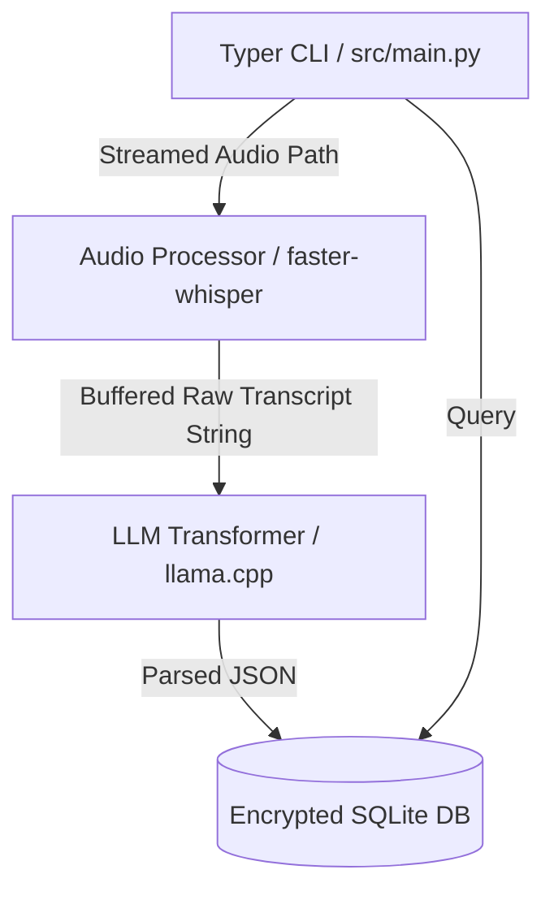

# System Architecture

> *V2 Refined by: [Systems Integrator]*

## Component Diagram

## Data Flow & IPC (Systems Integrator)
1. User provides local filepath.
2. Typer validates file exists.
3. **Memory Management**: To avoid loading massive 500MB audio files completely into RAM, the audio is streamed via a generator buffer into `faster-whisper`.
4. `faster-whisper` decodes audio to text in memory, utilizing only standard IPC signals to prevent memory deadlocks.
5. `llama-cpp` takes prompt + text + JSON Grammar.
6. `llama-cpp` produces guaranteed JSON output (constrained by Llama grammar).
7. Pydantic validates JSON dynamically.
8. `sqlmodel` writes to SQLite using synchronous batching.
